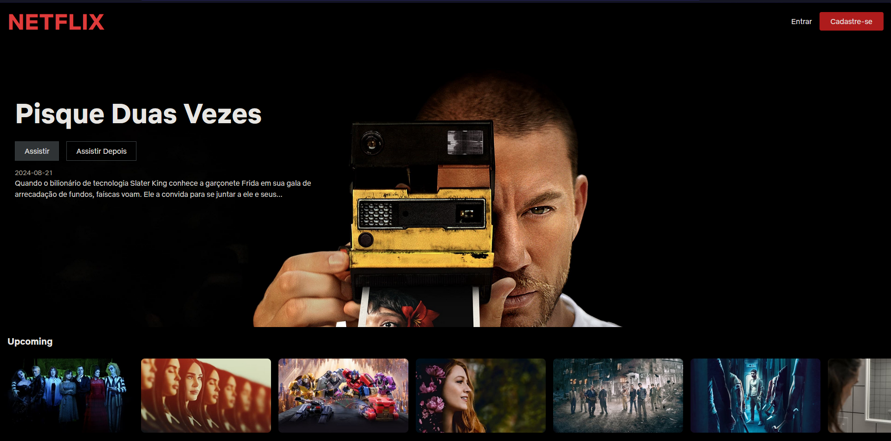
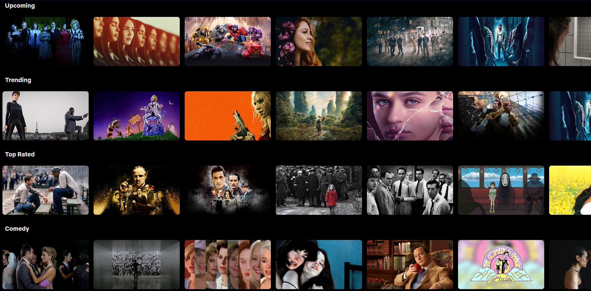
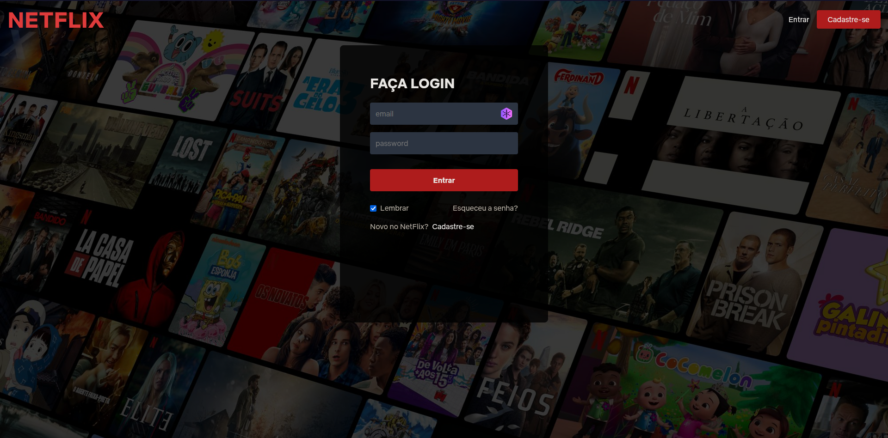

  
  

  <h3 align="center">Netflix Clone</h3>

  
Índice

  <ol>
    <li>
      <a href="#pré-requisitos">Pré-requisitos</a>
    </li>
    <li><a href="#bibliotecas-usadas">Bibliotecas</a></li>

 

  
  
Home Page
  
  
  
Grid de gêneros

  
  
Login

## Pré-requisitos

-   Crie uma conta se você ainda não tiver no [TMDB](https://www.themoviedb.org/), pois será preciso da chave de API para consumir os dados.
-   Em seguida, siga as instruções da [documentação](https://developer.themoviedb.org/docs/getting-started) para criar uma chave API.
-   Por fim, clone o projeto e crie um arquivo chamado `.env`, copie e cole o conteúdo de `.env.example`. Em seguida, cole a chave de API que você acabou de criar.

## Bibliotecas usadas

-   [react](https://pt-br.legacy.reactjs.org/)
-   [react-router-dom@v6.26.2](https://reactrouter.com/en/main)
-   [react-icons](https://react-icons.github.io/react-icons/)
-   [tailwindcss](https://tailwindcss.com/)
-   [axios](https://axios-http.com/)
